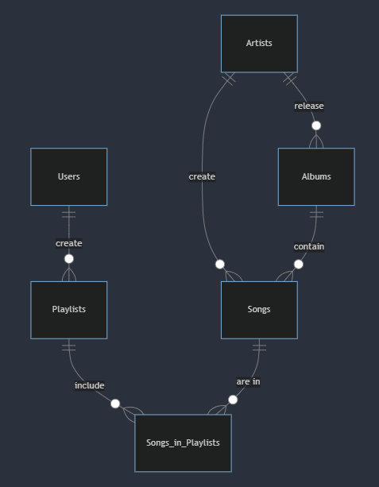

# SongSQL Design Document

By **Shayaan Musthafa**

Video overview: https://www.youtube.com/watch?v=2saduRiu3cQ

## Scope

This database for my CS50 SQL final project, named **SongSQL**, included all entities necessary for adding users and their created playlists containing songs from different artists and their albums. Detailed below is what is included in the database's scope:

* **Users**, containing identifying information like their unique username and email.
* **Artists**, containing identifying information about them like their name and personal bio.
* **Albums**, containing information about a song's album and who created them.
* **Songs**, containing information about who created the song and what album it is in.
* **Playlists**, containing information about which user created what playlist.
* **Songs in Playlists**, containing information about what songs are included in what playlist.

Certain out-of-scope elements like social features, artist collaborations, and playlist privacy are considered non-core attributes of this database as they are not required for a small-scale song database.

## Functional Requirements

This database will support:

* CRUD operations for users and their playlists, and artists and their songs (and albums)
* Tracking user added songs to their created playlists and songs uploaded by artists

## Representation

These entities are captured in SQLite tables with this schema.

### Entities

#### Users

The `users` table includes:

* `id`: The unique ID for the user, set as an auto-incremented `INTEGER`. Therefore, this column has the `PRIMARY KEY` constraint.
* `name`: The name of the user, set as a `TEXT`.
* `email`: The email the user used to register, set as a `TEXT`.
* `username`: The username the user created, set as a `TEXT`. The `UNIQUE` constraint is also used to make sure all usernames are unique.

All columns in the `users` table have the `NOT NULL` constraint as the are required, except for the `PRIMARY KEY` constraint.

#### Artists

The `artists` table includes:

* `id`: The unique ID for the artist, set as an auto-incremented `INTEGER`. Therefore, this column has the `PRIMARY KEY` constraint.
* `name`: The name of the artist, set as a `TEXT`.
* `about`: A short bio about the artist, set as a `TEXT`.

Only the `name` column in the `artists` table has the `NOT NULL` constraint as the are required, as it is not required for the `PRIMARY KEY` constraint and the `about` column.

#### Albums

The `albums` table includes:

* `id`: The unique ID for the album, set as an auto-incremented `INTEGER`. Therefore, this column has the `PRIMARY KEY` constraint.
* `artist_id`: The ID of the artist who has created the album, set as an `INTEGER`. Therefore, this column has the `FOREIGN KEY` constraint.
* `title`: The title of the album, set as a `TEXT`.
* `release_year`: The year the album was released, set as an `INTEGER`.

All columns in the `albums` table have the `NOT NULL` constraint as the are required, except for any `PRIMARY KEY` or `FOREIGN KEY` constraint.

#### Songs

The `songs` table includes:

* `id`: The unique ID for the song, set as an auto-incremented `INTEGER`. Therefore, this column has the `PRIMARY KEY` constraint.
* `artist_id`: The ID of the artist who has created the song, set as an `INTEGER`. Therefore, this column has the `FOREIGN KEY` constraint.
* `album_id`: The ID of the album where the song is located, set as an `INTEGER`. Therefore, this column has the `FOREIGN KEY` constraint.
* `title`: The title of the song, set as a `TEXT`.
* `duration`: How long the song lasts, set as an `INTEGER`. A `CHECK` constraint is used to make sure the value is positive.

All columns in the `songs` table have the `NOT NULL` constraint as the are required, except for any `PRIMARY KEY` or `FOREIGN KEY` constraint.

#### Playlists

The `playlists` table includes:

* `id`: The unique ID for the playlist, set as an auto-incremented `INTEGER`. Therefore, this column has the `PRIMARY KEY` constraint.
* `user_id`: The ID of the user who created the playlist, set as an `INTEGER`. Therefore, this column has the `FOREIGN KEY` constraint.
* `title`: The title of the playlist, set as a `TEXT`.
* `created`: When the playlist was created, set as an `INTEGER`. The default value for this attribute is the current timestamp, as seen by `DEFAULT CURRENT_TIMESTAMP`.

All columns in the `playlists` table have the `NOT NULL` constraint as the are required, except for any `PRIMARY KEY` or `FOREIGN KEY` constraint.

#### Songs in PLaylists

The `songs_in_playlists` table includes:

* `playlist_id`: The ID of the playlist where a song should be added, set as an `INTEGER`. Therefore, this column has the `FOREIGN KEY` constraint.
* `song_id`: The ID of the song that should be added to a playlist, set as an `INTEGER`. Therefore, this column has the `FOREIGN KEY` constraint.

The `songs_in_playlists` table just shows the relationship between if a song is in a playlist. The `PRIMARY KEY` constraint constraint helps to make sure that duplicate songs aren't added to a playlist

### Relationships

As detailed in the diagram above:

* A **user** is able to create 0 or multiple playlists. Each **playlist** is created by a specific user.
* An **artist** is able to create 0 or multiple songs. Each **song** is created by exactly one artist.
* An **artist** is able to release 0 or multiple albums. Each **album** is created by exactly one artist.
* An **album** is able to contain 0 or multiple songs. Each **song** is part of a single album.
* A **playlist** is able to contain 0 or multiple songs. Each **song** can only be in a playlist once.
* A **song** is able to be in 0 or multiple songs. Each **playlist** can only have a single song in them.

## Optimizations

### Indexes

* `user_index`: Speeds up searches for user usernames.
* `artist_name_index`: Speeds up searches for artists on their names.
* `album_index`: Speeds up searches for albums by a specific artist.
* `album_title_index`: Speeds up searches for albums by their title.
* `song_index`: Speeds up searches for songs with specific artists and their relevant albums.
* `song_title_index`: Speeds up searches for songs by their title.
* `playlist_index`: Speeds up searches for playlists by which user that created them and what title was given for it.
* `songs_in_playlist_index`: Speeds up searches to find specific songs in certain playlists.

### Views

* `user_playlists`: Displays every user-created playlists.
* `artist_songs`: Displays every artist released songs.
* `album_songs`: Displays all songs in an album.
* `playlist_songs`: Displays all songs in every playlist.

## Limitations

The current schema assumes that individual artists create albums and even songs. For albums and songs that are collaborative works, a many-to-many relationship might be required to show this.
